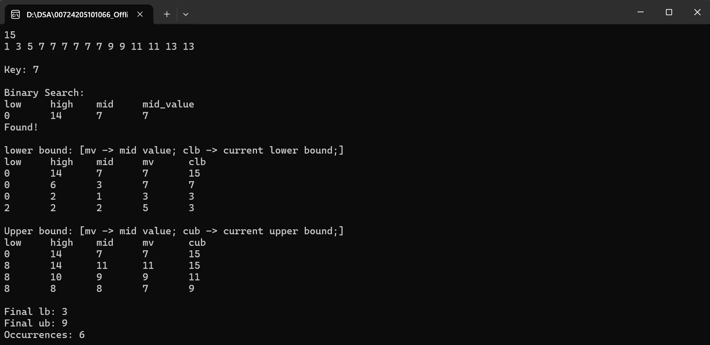

# Binary Search, Lower Bound & Upper Bound Visualization

A beginner-friendly **C++ visualization tool** that demonstrates how **Binary Search**, **Lower Bound**, and **Upper Bound** work internally. The program prints every iteration, allowing you to observe how the search space changes until the final answer is found.

## ✨ Features

* Step-by-step **Binary Search** visualization
* Step-by-step **Lower Bound** visualization
* Step-by-step **Upper Bound** visualization
* Displays the values of:

  * `low`
  * `high`
  * `mid`
  * `mid value`
* Calculates the total number of occurrences using: `occurrences = upper_bound - lower_bound;`

## Getting Started

### Method - 1: Compile and Run in Code::Blocks

* Open Code::Blocks.
* Go to **File → Open** and select `binary_search-lower_bound-upper_bound-visualization.cpp`.
* Save the file if needed.
* Click **Build and Run** or press **F9**.

### Method - 2: 

* Compile: 

  * `g++ binary_search-lower_bound-upper_bound-visualization.cpp -o app`

- Run

  * **Linux or macOS**

    * ./app
  * **Windows**

    * app.exe


## Sample Input

```text
15
1 3 5 7 7 7 7 7 7 9 9 11 11 13 13
7
```


## Sample Output

<p align="center">
  
</p>


## Time Complexity

| Operation        | Complexity |
| ---------------- | ---------- |
| Binary Search    | O(log n)   |
| Lower Bound      | O(log n)   |
| Upper Bound      | O(log n)   |
| Occurrence Count | O(1)       |


## Concepts Covered

* Binary Search
* Lower Bound
* Upper Bound
* Searching in Sorted Arrays
* Competitive Programming Basics


## ⭐ If You Like This Project

If you found this project helpful, consider giving it a **⭐ Star** on GitHub. It helps others discover the repository and motivates future improvements.

---

Made with ❤️ in C++ for learning and visualization.
